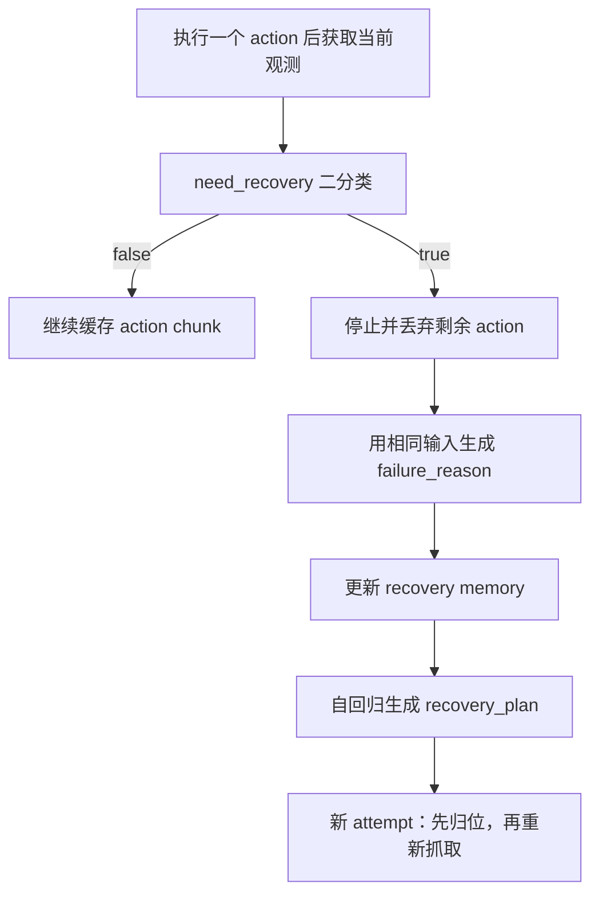

# 触觉 VLA 改进方案交接文档

## 1. 文档范围

本文是对《触觉 VLA 第一版方案》的增量交接，仅记录后续讨论中已经确认的改进内容，不重复第一版中未发生变化的部分。若本文与第一版存在冲突，以本文为准。

当前任务范围进一步收敛为：

> 基于触觉推理的偏心物体抓取多步自适应恢复。

系统需要在“抓取—抬升—转移”过程中持续判断当前执行是否需要恢复；发生失败后，立即停止当前执行并丢弃剩余 action，基于触发判断时的同一组多模态输入诊断失败原因，再生成新的抓取点调整方案。系统不设置独立的安全回退或重置过程，归位动作由下一次 attempt 开头的 action 输出。

## 2. 相对第一版的核心改动

| 第一版设计 | 确认后的改进 |
|---|---|
| 高频模块输出 `contact_event / force trend / confidence / trigger` | Tactile Captioner 输出当前触觉状态、近期变化趋势和旋转方向 |
| 由触觉事件状态机产生 `trigger`，再决定是否调用 VLA | VLM 基于每个 action 后的最新多模态观测直接二分类 `need_recovery` |
| 触觉只以事件文本输入 VLM | 同一触觉历史形成两条通路：结构化文本输入 VLM，连续 latent 输入 action expert |
| VLM 输出开放式 `risk / recommended_recovery` | 推理输出收敛为 `need_recovery`、`failure_reason` 和 `recovery_plan` |
| 未明确支持连续多次失败后的经验利用 | 新增 attempt 级 `recovery_plan–failure_reason memory`，支持多步恢复 |
| 使用历史本体状态作为 action expert 的短期历史条件 | 用触觉时序 latent 替换历史本体状态序列，但保留当前本体状态 \(q_t\) |

## 3. 改进后的在线执行流程

π0.5 的 action expert 每次仍生成一个 action chunk，当前按 30 steps 设计。chunk 可以缓存，但恢复判断使用的观测与多模态表征不能沿用 chunk 开始时的旧结果。

每执行一个 action 后：

1. 获取当前图像 \(I_t\)。
2. 获取当前本体状态 \(q_t\)，并按 π0.5 的方式编码。
3. 加入最新触觉帧，更新长度为 30 的滚动触觉序列。
4. Tactile Captioner 生成当前结构化触觉描述。
5. VLM 重新读取当前图像、当前状态、当前触觉描述以及任务指令或当前 `recovery_plan`。
6. 非自回归二分类头输出 `need_recovery`。

当 `need_recovery=false` 时：

- 不输出 `failure_reason`；
- 不生成长文本；
- 不重新生成 action chunk；
- 继续执行缓存 chunk 中的下一个 action。

当 `need_recovery=true` 时：

1. 立即停止当前执行并丢弃 chunk 中尚未执行的 action。
2. 保持触发 `need_recovery=true` 时的输入不变，VLM 使用与二分类完全相同的当前图像、当前本体状态、触觉描述、任务指令和当前 `recovery_plan`，继续自回归生成 `failure_reason`。
3. 将本次 `recovery_plan` 与生成的 `failure_reason` 写入长记忆。
4. 使用更新后的长记忆和失败触发时的当前观测，进行第二次独立的自回归，生成新的 `recovery_plan`。
5. action expert 根据新方案生成下一次 attempt 的 action。该 attempt 开头先输出归位动作，再按照新的 `recovery_plan` 重新抓取。



## 4. Tactile Captioner 的改进

### 4.1 输入与时序结构

Captioner 使用实时滚动触觉序列：

\[
S_t=[x_{t-29},\ldots,x_t]
\]

每执行一个 action，窗口更新一次。结构上分为：

- 最新帧分支：提取当前接触面积和三轴力水平；
- 时序分支：使用空间编码器与 TCN 提取面积趋势、三轴力趋势和触觉表面旋转。

当前只向 VLM 输出一套左右触觉融合后的描述，不分别生成左、右传感器文本。左右三轴力在融合前必须先变换到统一坐标系。

### 4.2 输出字段

| 字段 | 固定取值 |
|---|---|
| `area` 当前状态 | `none / small / medium / full` |
| `Fx/Fy/Fz` 当前状态 | `strong negative / weak negative / near zero / weak positive / strong positive` |
| `area` 近期趋势 | `increasing / stable / decreasing` |
| `Fx/Fy/Fz` 近期趋势 | `more negative / stable / more positive` |
| `rotation` | `none / clockwise / counterclockwise` |

三轴力的趋势描述有符号数值的变化方向，因此固定使用 `more negative / stable / more positive`，不使用容易产生歧义的 `increasing / decreasing`。

`rotation` 表示触觉表面的旋转运动，本身由历史序列判断，不再拆成“当前值”和“趋势”。顺、逆时针统一基于左侧触觉传感器的固定观察方向定义。

### 4.3 输入 VLM 的固定文本

```text
Touch[
area=small(decreasing);
Fx=strong negative(more negative);
Fy=near zero(stable);
Fz=weak positive(more positive);
rotation=clockwise
]
```

固定语义为：

```text
物理量=当前状态(近期趋势)
```

括号外表示最新帧状态，括号内表示近期触觉序列的变化趋势。

## 5. 两级触觉历史记忆

### 5.1 长记忆：attempt 级显式文本

长记忆用于保存跨 attempt 的恢复经验，并作为 VLM 生成下一条 `recovery_plan` 时的 prompt。它只记录有恢复决策价值的信息，不保存逐帧图像、触觉 caption、动作轨迹或连续隐藏状态。

完整顺序为：

```text
初始任务执行
→ initial failure_reason
→ recovery_plan 1
→ failure_reason 1
→ recovery_plan 2
→ failure_reason 2
→ ...
```

第一次失败前没有恢复方案，因此单独记录 `initial failure_reason`。之后每条完整 attempt 记录一对：

```text
Attempt 1
recovery_plan=move horizontally left, move vertically down.
failure_reason=rotate clockwise,grasp too_high.
```

当前正在执行、结果尚未确定的 `recovery_plan` 不提前写入历史；只有该方案执行失败后，才与本次 `failure_reason` 组成一条完整 attempt memory。当前方案在执行 prompt 中单独提供。

### 5.2 短记忆：触觉时序 latent

短记忆由近期触觉序列编码后直接输入 action expert，不使用触觉文本：

```text
近期触觉序列
  → tactile temporal encoder
  ├─ 分类头 → 结构化 tactile caption → VLM
  └─ continuous latent → action projection → action expert
```

action expert 的条件改为：

\[
a_{t:t+H}=
\operatorname{ActionExpert}
\left(
H_{\mathrm{VLM}},
q_t,
P_{\mathrm{action}}(z_t^{\mathrm{tac}}),
a_{t:t+H}^{\mathrm{noise}}
\right)
\]

即用触觉时序 latent 替换第一版/此前版本中的历史本体状态序列，同时保留当前时刻本体状态 \(q_t\)。触觉 latent 进入 action expert 前使用独立投影层，以适配动作生成所需的特征空间。

## 6. VLM 推理输出协议

推理阶段只保留三个输出：

| 输出 | 方式 | 时机 |
|---|---|---|
| `need_recovery` | 非自回归二分类 | 每个 action 执行后 |
| `failure_reason` | 受限模板的自回归生成 | 仅当 `need_recovery=true` |
| `recovery_plan` | 受限模板的自回归生成 | memory 更新后、下一次 attempt 开始前 |

`need_recovery` 与 `failure_reason` 使用完全相同的输入，并采用条件输出：

```text
need_recovery=false
```

此时推理立即结束。

```text
need_recovery=true
failure_reason=rotate clockwise,grasp too_high.
```

此时二分类结果控制 VLM 基于同一多模态输入继续自回归生成 `failure_reason`。在两者之间不执行机械臂动作、不重新采集观测，也不替换输入状态。

`recovery_plan` 不与 `failure_reason` 在同一次自回归中生成。系统先更新 long memory，再基于更新后的 memory 和失败触发时的当前观测进行第二次独立自回归：

```text
recovery_plan=move horizontally left, move vertically down.
```

不再设置 `failure_type`，也不输出开放式长推理文本。

## 7. 偏心物体抓取的固定模板

### 7.1 Failure reason

固定模板：

```text
failure_reason=rotate {rotation},grasp {grasp_position}.
```

固定取值：

```text
rotation:
- none
- clockwise
- counterclockwise

grasp_position:
- too_high
- too_low
- appropriate
- missing
```

字段含义：

- `rotate`：物体在抓取或抬升过程中的旋转方向；
- `grasp`：夹爪在物体竖直方向上的接触位置；
- `missing`：未形成有效抓取或未接触到目标。

### 7.2 Recovery plan

固定模板：

```text
recovery_plan=move horizontally {horizontal_direction}, move vertically {vertical_direction}.
```

固定取值：

```text
horizontal_direction:
- left
- right
- front
- back
- none

vertical_direction:
- up
- down
- none
```

两个调整维度的职责为：

- 水平移动：修正偏心抓取点，减小物体旋转；
- 竖直移动：修正抓取位置过高或过低造成的接触面积问题；
- `none`：该维度不需要调整。

模板的字段顺序、标点和词表均固定，不生成模板之外的自由表述。所有方向词必须在整套数据、训练和在线执行中使用同一固定坐标系。
